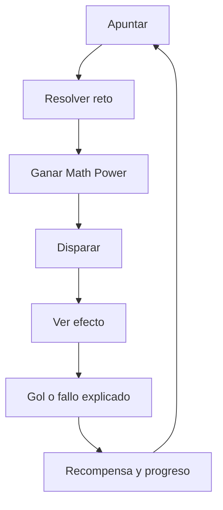

# PRD — Tiro Libre Matemático V9: Estado de Flujo

## 1. Resumen ejecutivo

Tiro Libre Matemático es un videojuego educativo de tiros libres creado para Martín. Su promesa es que el jugador se divierta primero y aprenda matemáticas dentro de la acción, observando cómo una buena decisión transforma el comportamiento del balón.

V9 debe consolidar tres avances:

1. **Justicia perceptible:** el punto seleccionado, la animación y el resultado deben coincidir.
2. **Progresión con sentido:** tablas de multiplicar → coordenadas → física → integración.
3. **Estado de flujo:** reto ajustado a la habilidad, feedback inmediato y recuperación respetuosa después del error.

## 2. Problema

La experiencia anterior presenta riesgos que rompen el flujo:

- Un tiro visualmente bueno puede resolverse como malo por diferencias entre modelos de coordenadas o por azar oculto.
- El jugador puede encontrar conceptos avanzados antes de construir las bases matemáticas necesarias.
- La dificultad temporal, matemática y futbolística puede aumentar al mismo tiempo.
- El feedback no siempre distingue entre error matemático, mala elección táctica, atajada y barrera.
- La adaptación existente no mantiene todavía un perfil de dominio por tema.

Cuando el jugador no puede comprender por qué acertó o falló, deja de percibir control y el aprendizaje pierde valor.

## 3. Visión

> Cada cálculo genera un poder, cada poder cambia el disparo y cada disparo enseña algo visible.

La experiencia debe sentirse como un videojuego de fútbol infantil, energético y claro; no como un cuestionario con una animación añadida.

## 4. Usuario principal

### Martín — jugador aprendiz

- Niño de aproximadamente 11–12 años.
- Juega en navegador con mouse, teclado o pantalla táctil.
- Quiere marcar goles, desbloquear mundos y sentir dominio.
- Necesita comprender el resultado sin depender de una explicación adulta.
- Se beneficia de ayudas graduales, segunda oportunidad y feedback no punitivo.

### Usuario secundario

Madre, padre o acompañante que desea observar avance por tema sin interrumpir la sesión de juego.

## 5. Objetivos de producto

| Objetivo | Indicador V9 |
|---|---|
| Hacer comprensible cada tiro | El resultado explica selección, destino y causa |
| Mantener flujo | Éxito móvil objetivo entre 70 % y 85 % por bloque |
| Dar sentido al aprendizaje | Cada mundo declara y practica un objetivo pedagógico |
| Conectar cálculo con acción | Todo acierto concede un Math Power visible |
| Evitar frustración acumulada | Dos errores activan apoyo; tres fallos futbolísticos reducen reto deportivo |
| Preservar calidad | CI verde con typecheck, unit, coverage, build y E2E |

## 6. No objetivos de V9

- Multijugador en línea.
- Backend, login o sincronización entre dispositivos.
- Inteligencia artificial generativa dentro del juego.
- Tienda con dinero real, publicidad o monetización.
- Nuevos deportes.
- Currículo escolar completo o panel docente avanzado.

## 7. Loop principal

El ciclo debe poder repetirse sin pantallas innecesarias. El siguiente tiro debe estar disponible rápidamente después del feedback.

## 8. Progresión pedagógica

| Mundo | Niveles | Aprendizaje | Poder dominante | Dificultad futbolística |
|---|---:|---|---|---|
| Academia de tablas | 1–2 | Tablas 2–5 y 6–9 | Precisión | Sin portero → portero central lento |
| Mapa del gol | 3–4 | Coordenadas positivas y plano cartesiano | Turbo/precisión | Objetivos más pequeños y portero activo |
| Laboratorio del balón | 5–7 | Ángulos, trayectorias, velocidad y distancia | Curva/Turbo | Barrera, viento suave y combinaciones |
| Copa STEM | 8 | Integración de todos los conceptos | Perfecto | Partido final justo y legible |

Cada mundo sigue: descubrimiento → práctica → dominio → desafío → celebración.

## 9. Dificultad y flujo

La dificultad tiene tres ejes independientes:

- **Matemática:** rango de números, número de pasos y concepto.
- **Futbolística:** portero, barrera, viento, tamaño de zona y objetivo.
- **Temporal:** tiempo, etapas de ayuda y retry.

Regla de producto: en un mismo ajuste adaptativo solo cambia un eje. Se prioriza ajustar primero el eje futbolístico; después ayudas; finalmente dificultad matemática al cambiar de nivel o demostrar dominio sostenido.

### Ritmos elegibles

| Ritmo | Comportamiento |
|---|---|
| Fácil, por defecto | Más tiempo, ayudas a 15/8/5 s y segunda oportunidad de 5 s |
| Intermedio | Tiempo equilibrado, ayudas y retry breve de 3 s |
| Difícil | Presión original, sin retry y ayudas mínimas |

## 10. Math Powers

| Poder | Regla | Efecto observable |
|---|---|---|
| Precisión | Acierto de multiplicación | Reduce o elimina dispersión |
| Curva | Acierto de ángulo | Añade efecto útil para superar barrera |
| Turbo | Acierto de coordenada o velocidad | Más potencia y animación veloz |
| Perfecto | Acierto rápido, primer intento | Precisión, potencia, curva, estela y micro cámara lenta |

Un Math Power mejora el tiro pero no debe falsificar las reglas: un tiro central todavía puede ser atajado y uno bajo puede chocar con la barrera.

## 11. Requisitos funcionales de alto nivel

- RF-01: mantener un modelo único de coordenadas para puntero, balón y resolución.
- RF-02: hacer determinista el resultado a partir de inputs explícitos.
- RF-03: explicar la causa de cada resultado.
- RF-04: organizar ocho niveles en cuatro mundos progresivos.
- RF-05: conceder y representar Math Powers.
- RF-06: aplicar ayudas graduales y retry según ritmo.
- RF-07: adaptar el reto en bloques de cinco tiros.
- RF-08: guardar progreso, preferencias y dominio por concepto localmente.
- RF-09: migrar perfiles anteriores sin pérdida de logros.
- RF-10: permitir navegación y juego con mouse, touch y teclado.

## 12. Requisitos no funcionales

- Carga DOM objetivo menor a 3 s en el E2E actual.
- Heap JavaScript menor a 100 MB en el recorrido de humo.
- Sin overflow horizontal a 390×844.
- Controles con nombre accesible; foco visible; imágenes con texto alternativo.
- Animaciones esenciales basadas en `transform` y `opacity`.
- Soporte de `prefers-reduced-motion`.
- Estado y reglas centrales testeables fuera de React.
- Sin errores de consola o excepciones de runtime en el E2E.

## 13. Métricas

### Métricas de experiencia

- Tiempo hasta el primer disparo: objetivo menor a 45 s.
- Duración saludable de sesión: 8–15 minutos.
- Tasa de éxito por bloque: 70–85 % como zona de flujo.
- Tiempo entre resultado y siguiente intento: objetivo menor a 4 s cuando el jugador continúa.
- Recuperación: volver a un acierto dentro de los dos tiros posteriores a una intervención de ayuda.

### Métricas de aprendizaje

- Precisión matemática por concepto.
- Tiempo medio de respuesta por concepto.
- Porcentaje de aciertos sin ayuda y sin retry.
- Dominio estimado por tablas, coordenadas, ángulos y velocidad.
- Reducción del uso de ayudas a lo largo de sesiones.

## 14. Criterios de lanzamiento

V9 se considera lista cuando:

1. Un tiro repetido con los mismos inputs produce el mismo resultado.
2. La animación termina en la posición que evalúa el motor.
3. Los niveles aparecen en el orden pedagógico definido.
4. El jugador puede explicar por qué ocurrió cada resultado leyendo el feedback.
5. Las ayudas y retries se comportan según el ritmo.
6. La migración preserva progreso anterior.
7. Todas las pruebas y puertas de CI están verdes.
8. Una sesión observada con Martín no revela un bloqueo crítico del loop.

## 15. Riesgos y mitigaciones

| Riesgo | Mitigación |
|---|---|
| Determinismo percibido como falta de variedad | Variar retos y contexto, no la justicia del resultado |
| Adaptación demasiado visible | Ajustes pequeños y sin mensajes técnicos |
| Exceso de efectos rompe el ritmo | Microanimaciones y celebración breve |
| Reordenamiento invalida progreso previo | Migración versionada y desbloqueo equivalente |
| Pruebas frágiles por timers/animación | Reloj inyectable, RNG ausente del core y fake timers |
