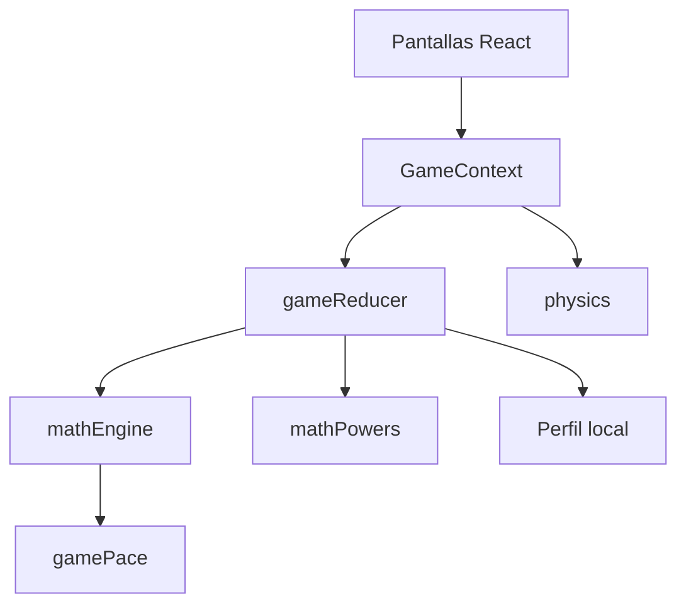
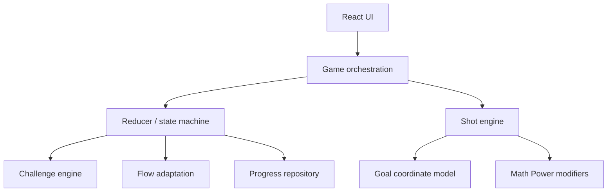
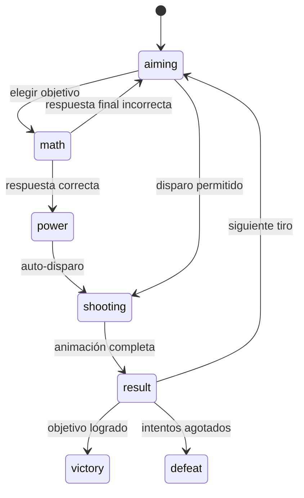

# Arquitectura técnica V9

## 1. Estrategia

Evolucionar la arquitectura actual, no reescribirla. La repo ya separa pantallas, reducer, física, matemáticas, ritmo y poderes. V9 debe reforzar contratos puros y eliminar las fuentes de inconsistencia.

## 2. Arquitectura actual relevante



Archivos centrales actuales:

- `client/src/game/screens/GameplayScreen.tsx`
- `client/src/game/screens/LevelSelectScreen.tsx`
- `client/src/game/engine/GameContext.tsx`
- `client/src/game/engine/gameReducer.ts`
- `client/src/game/engine/gameFlow.ts`
- `client/src/game/engine/gamePace.ts`
- `client/src/game/engine/mathPowers.ts`
- `client/src/game/engine/physics.ts`
- `client/src/game/math/mathEngine.ts`
- `client/src/game/levels/levelData.ts`

## 3. Arquitectura objetivo



Las flechas representan dependencia. Los módulos inferiores no importan React ni DOM.

## 4. Decisiones arquitectónicas

### ADR-01 — Un solo modelo de coordenadas

**Decisión:** centralizar:

```ts
coordToGoalPoint(coord, quadrants): Vec2
goalPointToCoord(point, quadrants): Vec2
```

El resultado normalizado debe ser la entrada de animación, portero, barrera y límites de gol.

**Prohibido:** duplicar fórmulas de conversión dentro de `GameplayScreen`.

### ADR-02 — Resolución determinista

**Decisión:** el motor recibe un objeto de entrada completo y retorna un `ShotResolution` inmutable.

```ts
interface ShotInput {
  targetCoord: Vec2;
  gridQuadrants: 1 | 4;
  mathCorrect: boolean;
  basePower: number;
  spin: number;
  mathPower: MathPower;
  keeper: KeeperSnapshot;
  wall: WallSnapshot[];
  wind: WindSnapshot;
}

interface ShotResolution {
  targetPoint: Vec2;
  landingPoint: Vec2;
  actualCoord: Vec2;
  trajectoryPoints: Vec2[];
  outcome: "goal" | "saved" | "blocked" | "missed";
  reasonCode: ShotReasonCode;
  appliedModifiers: AppliedModifier[];
}
```

No se llama `Math.random()` dentro de la resolución. Si en el futuro se desea variedad, el estado variable se genera antes y queda visible como input o se utiliza un RNG con semilla registrada.

### ADR-03 — Reducer sin efectos

El reducer actual debe continuar puro. Timers, audio, persistencia y animación viven en orquestadores/hooks. Las decisiones centrales se expresan como transiciones de estado testeables.

### ADR-04 — Adaptación mediante reglas puras

Crear `flowEngine.ts` con funciones puras:

```ts
evaluatePerformanceWindow(window): FlowAssessment
selectFlowIntervention(assessment, currentConfig): FlowIntervention
applyFlowIntervention(levelRuntime, intervention): LevelRuntime
```

La intervención se aplica entre tiros, nunca durante el vuelo.

### ADR-05 — Persistencia versionada

Centralizar acceso a localStorage en `progressRepository.ts`. Ninguna pantalla accede directamente a claves del perfil.

```ts
interface PersistedGameDataV2 {
  schemaVersion: 2;
  profile: PlayerProfile;
  settings: GameSettings;
  mastery: Record<MathDomain, MasteryState>;
  recentEvents: GameplayEvent[];
}
```

La migración `v1 → v2` debe ser pura, idempotente y cubierta por tests.

## 5. Estructura objetivo sugerida

```text
client/src/game/
  engine/
    coordinates.ts          # transformación única de portería
    shotEngine.ts           # resolución determinista
    trajectory.ts           # puntos de animación
    outcomeFeedback.ts      # reasonCode → copy de UI
    flowEngine.ts           # adaptación por ventana
    gameReducer.ts
    gameFlow.ts
    gamePace.ts
    mathPowers.ts
    types.ts
  math/
    challengeFactory.ts
    distractors.ts
    mastery.ts
  levels/
    levelData.ts
    worlds.ts
  persistence/
    progressRepository.ts
    migrations.ts
  analytics/
    gameplayEvents.ts
  screens/
  test/
```

Manus puede migrar gradualmente los archivos actuales; no es obligatorio hacer todos los movimientos en un único commit.

## 6. Estado y máquina de juego

Estados principales:



Si se conserva `phase` como union type, añadir `power` explícitamente o documentar que la superposición Math Power ocurre dentro de la transición `math → aiming`. Evitar estados implícitos contradictorios.

Invariantes:

- `shooting` requiere `targetCoord` y `shotResolution`.
- `result` requiere `lastShotResult`.
- La resolución no cambia después de iniciar `shooting`.
- Solo puede existir un timer de auto-disparo.
- Reiniciar/cambiar nivel cancela timers pendientes.

## 7. Configuración de niveles

Extender `LevelConfig`:

```ts
interface LevelConfig {
  id: number;
  world: 1 | 2 | 3 | 4;
  learningGoal: string;
  multiplicationRange?: readonly [number, number];
  // conservar campos actuales
}
```

Separar configuración curricular estable de ajustes runtime adaptativos:

```ts
interface LevelRuntimeModifiers {
  keeperReachMultiplier: number;
  targetSizeMultiplier: number;
  assistanceLeadSeconds: number;
  windMultiplier: number;
  intervention?: FlowIntervention;
}
```

No mutar `LEVELS` globalmente.

## 8. Generación matemática

Requisitos del motor:

- Permitir RNG inyectable en tests, aunque el reto pueda variar en producción.
- Generar distractores con signos válidos.
- Garantizar conjunto único y respuesta incluida una vez.
- Respetar `multiplicationRange`.
- En Copa STEM, usar un selector balanceado con historial de tipos recientes.
- Separar contenido del reto de temporización; `gamePace` aplica el tiempo final.

## 9. Render y animación

`GameplayScreen` debe recibir `ShotResolution` y solo representarla.

- Calcular la trayectoria antes de comenzar la animación.
- Usar `requestAnimationFrame` o Framer Motion sin recalcular física.
- El último punto visual debe mapear `landingPoint`.
- La posición visual del portero debe provenir del mismo snapshot evaluado por el motor.
- Sonido y partículas reaccionan a `outcome` y `mathPower`; nunca determinan lógica.

## 10. Compatibilidad y migración

- Leer la clave existente antes de introducir una nueva.
- Normalizar `unlockedLevels` después de reordenar currículo.
- Conservar `completedLevels` por ID y documentar el mapeo.
- Si el perfil antiguo tiene todos los niveles abiertos, no bloquearlos de nuevo.
- Escribir el formato nuevo solo después de migración válida.
- Mantener fallback seguro si localStorage no está disponible.

## 11. Seguridad y privacidad

- No recopilar nombre real obligatorio.
- No enviar analítica a terceros.
- No introducir secretos ni claves en frontend.
- No usar HTML sin sanitizar.
- Dependencias nuevas solo cuando aporten valor no cubierto por el stack.
- Auditar que el juego funciona offline después de cargar, salvo fuentes/assets externos ya existentes.

## 12. Estrategia de commits sugerida

1. `docs: add V9 flow specifications`
2. `refactor: unify goal coordinate model`
3. `fix: make shot resolution deterministic`
4. `feat: add progressive learning worlds`
5. `feat: add flow adaptation window`
6. `feat: persist mastery and migrate progress`
7. `test: cover V9 gameplay contracts`
8. `chore: update docs and release checklist`

Cada commit debe mantener typecheck y tests relacionados en verde.
